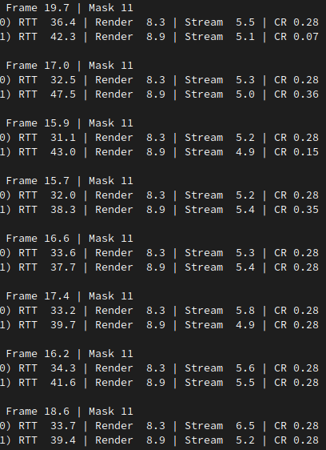

# Distributed Nano-Rendering
Distrubuted rendering via multiple nano-rendering servers running on ESP32 dev boards.




## Requirements

Server:
- [esp-idf](https://github.com/espressif/esp-idf)

Client:
- [vcpkg](https://vcpkg.io)
- C++20 compiler
- OpenGL 4.5 capable GPU
- Wi-Fi 802.11n capable wirless
- Wi-Fi hotspot mode

## Insall Dependencies

Server:
- [Install and setup ESP-IDF](https://docs.espressif.com/projects/esp-idf/en/latest/esp32/get-started/#installation)
- [Setup environment variables](https://docs.espressif.com/projects/esp-idf/en/latest/esp32/get-started/linux-macos-setup.html#get-started-set-up-env)

Client:
```
$ vcpkg install glfw3 glad
```

## Build Software

Server:
```
$ cd server
$ get_idf
$ idf.py flash monitor
```

Client:
```
$ cd client
$ cmake -B build -S . -DCMAKE_TOOLCHAIN_FILE=[path to vcpkg]/scripts/buildsystems/vcpkg.cmake
$ cmake --build build
```

## Usage

Configuration:  
Some basic configurarion parameters in [config.hpp](common/config.hpp)

Server:  
- Power ESP32 dev boards and connect to Wi-Fi hotspot
- Servers auto-start and attempt auto-reconnection during disconnects

Client:  
- Setup Wi-Fi hotspot on PC
- Launch client application
- (Optional) Press 1 for stream overlay mode
- (Optional) Press 2 for lost slice overlay mode

```
$ cd client\build
$ ./client
```

